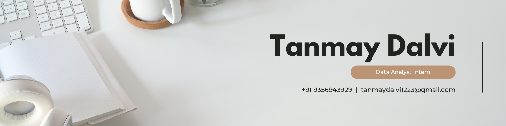

<!--
✨ Put your banner / GIF here (recommended width ~1000px)
-->

  

<h1 align="center">👋 Hi, I'm Tanmay Dalvi</h1>

  Aspiring <b>Data Scientist / Data Analyst</b> from Pune, India 
  Turning raw data into meaningful, actionable insights.

  <!-- Portfolio -->
  
  <!-- LinkedIn -->
  
  <!-- HackerRank -->
  

---

## 🧑‍💻 About Me

- 🎓 B.Tech in **Computer Science (AI/ML)** – G. H. Raisoni College of Engineering and Management, Pune  
- 📈 CGPA: **9.27 / 10.0**
- 📊 Passionate about **data analysis, dashboards, and data-driven decision making**
- 🧠 Interested in **Machine Learning, Business Intelligence, and Product Analytics**
- 🌱 Currently improving: **Python for Data Science, SQL, and Advanced Analytics**
- 📍 Based in **Pune, Maharashtra**

---

## 🛠️ Tech Stack & Tools

### Programming & Query Languages

  
  
  

### Data Analysis & Visualization

  
  

  
  
  
  

### Tools & Platforms

  
  
  

### Version Control

  
  

---

## 📚 Education

- **Bachelor of Technology – Computer Science (AI/ML)**  
  G. H. Raisoni College of Engineering and Management, Pune  
  <b>2022 – 2026</b> · CGPA: <b>9.27 / 10.0</b>

---

## 💼 Experience

### Data Analyst Intern – Excelerate, Dubai | USA · Aug 2025
- Cleaned and merged multiple raw datasets in **PostgreSQL**, improving data quality and consistency  
- Built a unified master table and mapped KPIs to power dashboard analytics  
- Helped design an interactive **Looker Studio** dashboard for real-time learner and program insights  

---

## 🚀 Selected Projects

### 🏀 Nike Sales Dashboard – Power BI
- Built an interactive dashboard on **$332M profit** across 2M units and 4 retailers  
- Analyzed sales by region, channel, and city; highlighted top-performing cities and revenue trends  

### ⚡ Electric Vehicle Market Analysis – Tableau
- Analyzed **150K+ EV registrations** across U.S. markets  
- Visualized manufacturer-wise market share (with Tesla leading) and regional adoption using maps  

### 🛒 Walmart Sales Data Analysis – Python & SQL
- Built a data pipeline using **Pandas + SQL** for retail analytics  
- Identified top-selling categories, preferred payment modes, and peak sales hours  

---

## 📜 Certifications

- **IBM Data Science Professional Certificate**  
- **GitHub Foundations Certification**

---

## 🏅 Achievements

- **Finalist – Innovex Hackathon 2025 (AIT Pune)**  
  Developed an ML-based activity recommendation app for children  
- **Selected Participant – Google Solution Challenge Bootcamp 2024 (Mumbai)**  
- **Academic Excellence Award** for maintaining **CGPA 9.27/10** in B.Tech

---

## 📫 Connect with Me

  
  
  
  

---

  <i>Data is the fuel, algorithms are the engine, and insights are the journey.</i>

